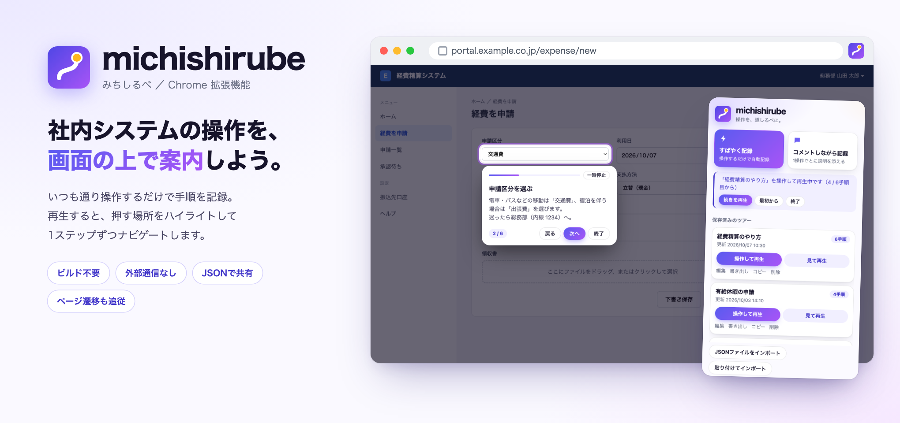
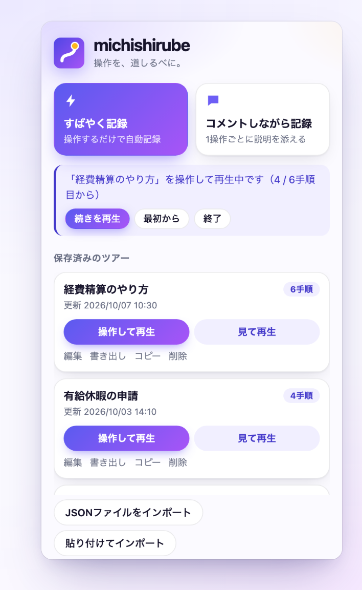
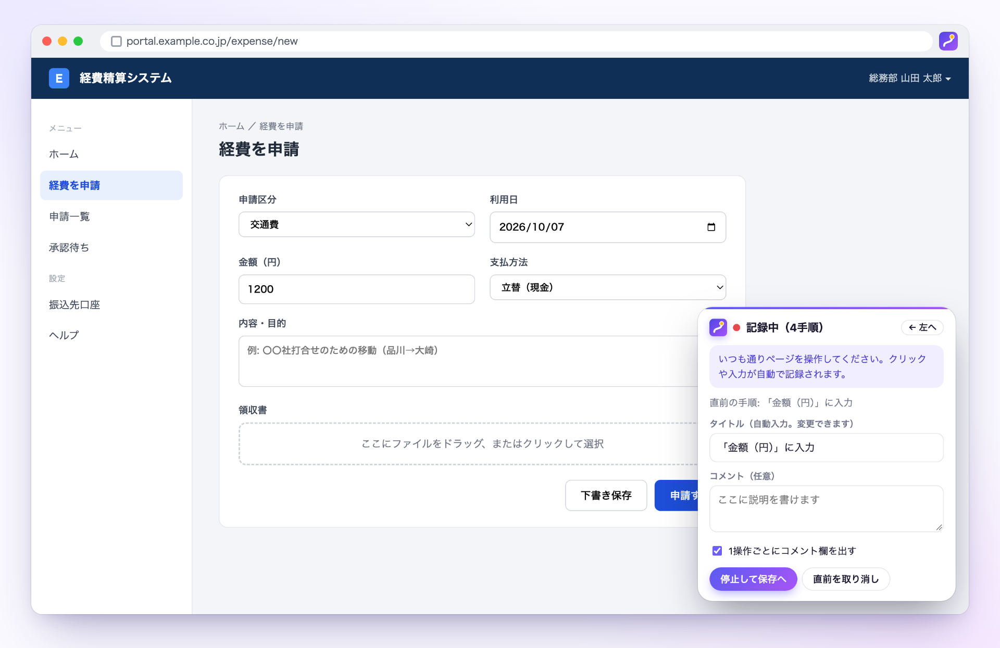
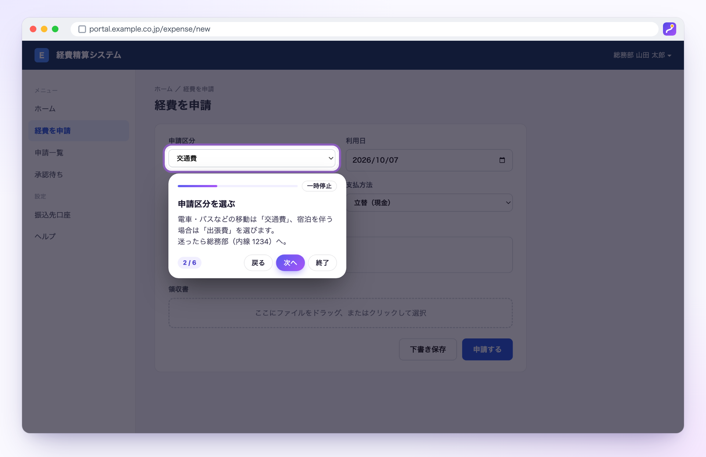
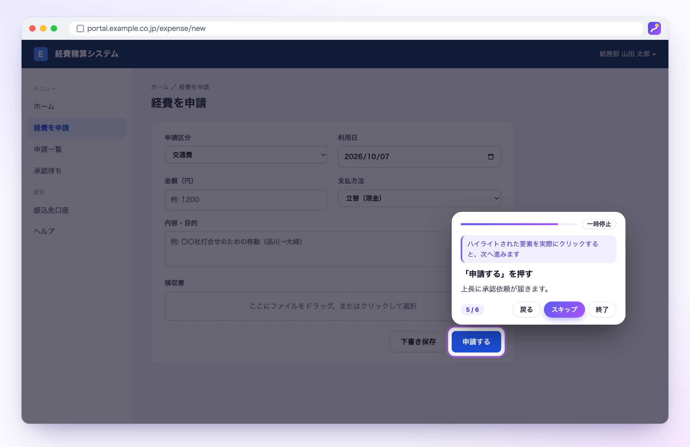
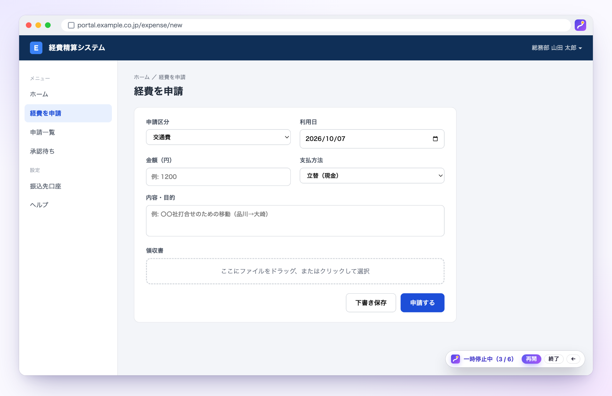
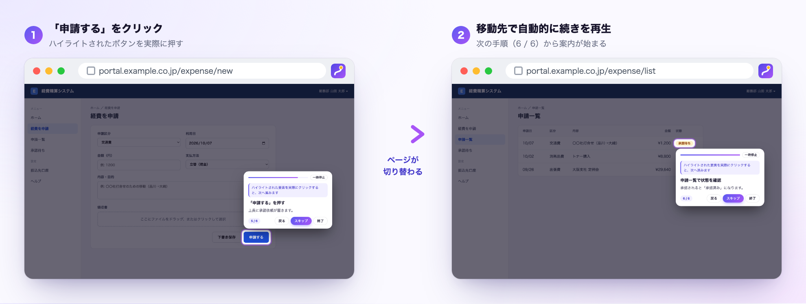
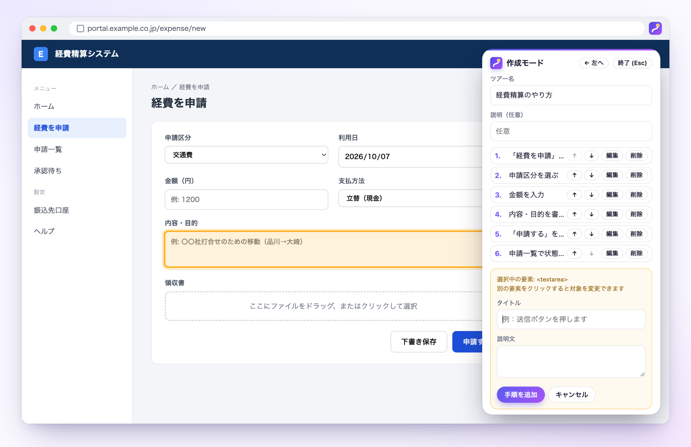

<p align="center">
  
</p>

<p align="center">
  <b>社内のWebシステムの画面上に「操作ツアー」を作って、そのまま再生できる Chrome 拡張機能</b><br>
  マニュアルを読む代わりに、画面の上で「次はここを押す」を案内します。
</p>

<p align="center">
  
  
  
  
</p>

---

## ✨ できること

| | |
|---|---|
| 🎬 **操作するだけで記録** | いつも通りクリック・入力するだけで手順が自動で記録されます。タイトルも自動で付きます |
| 🔦 **画面の上で案内** | 押す場所以外を暗くしてハイライトし、吹き出しで1ステップずつ説明します |
| 👆 **操作しながら覚える** | 「操作して再生」なら、ハイライトされた要素を実際に操作すると次の手順に進みます |
| 🔀 **ページ遷移にも追従** | リンクやフォーム送信でページが切り替わっても、移動先で自動的に続きを再生します |
| 📤 **JSONで共有** | ツアーは JSON ファイルで書き出し・取り込みできます。チャットに貼り付けて共有も可能です |
| 🔒 **社内でも安心** | 外部通信なし。入力した値は記録しません。権限も最小限です |

## 🚀 はじめかた

1. このリポジトリをダウンロード（または `git clone`）する
2. Chrome で `chrome://extensions` を開き、右上の **「デベロッパーモード」** をオンにする
3. **「パッケージ化されていない拡張機能を読み込む」** で、このフォルダ（`manifest.json` があるフォルダ）を選ぶ
4. ツールバーのアイコン、またはショートカット **`Ctrl+Shift+Y`**（Mac は **`⌘+Shift+Y`**）でポップアップを開く

> [!TIP]
> まずは動作確認用の `test/demo.html` で試すのがおすすめです。`python3 -m http.server` でローカルサーバーを立て、`http://localhost:8000/test/demo.html` を開いてください。
> `file://` で直接開く場合は、拡張機能の「詳細」で **「ファイルのURLへのアクセスを許可する」** をオンにします。

---

## 📖 使い方

<table>
<tr>
<td width="34%" valign="top">

</td>
<td valign="top">

### ポップアップ

アイコンをクリックすると開きます。ここから、すべての操作を始めます。

- **すばやく記録 / コメントしながら記録** … 操作を記録する
- **保存済みのツアー** … 「操作して再生」「見て再生」で再生する。編集・書き出し・コピー・削除もここから
- **JSONファイルをインポート / 貼り付けてインポート** … 共有されたツアーを取り込む
- **要素を選んで手順を作る** … ページの動作を止めて、要素を1つずつ選んでツアーを作る

再生や記録が途中で中断されたときは、上部に「**続きを再生**」「**このページで続きを記録**」が表示されます。

</td>
</tr>
</table>

### 1. 操作を記録する（いちばん手軽）



ポップアップで次のどちらかを押し、いつも通りページを操作するだけです。ページ本来の動作は止まりません。

| ボタン | 使いどころ |
|---|---|
| ⚡ **すばやく記録** | コメントなし。操作するだけで手順が自動記録される。「とりあえず残して共有」向け |
| 💬 **コメントしながら記録** | 1操作ごとにコメント欄が出る（書かなくてもOK）。説明を添えたいとき向け |

- クリック、チェック/ラジオの切り替え、入力欄・選択ボックスの変更が手順になります。タイトルは「「送信」をクリック」のように自動で付きます
- 入力した**値は記録しません**（どの要素を操作したかだけ）。パスワード等も保存されません
- 右下のパネルで、直前の手順の取り消し、コメント欄のオン/オフ切り替えができます
- 「停止して保存へ」→ ツアー名（既定は「操作記録 日時」）を確認して「保存」。続けて **JSONを書き出し / JSONをコピー** で共有できます。「コメントを編集」を押すと、あとからコメントや並べ替えもできます
- リンクのクリックなどでページが切り替わると記録は中断されますが、手順は下書きとして残ります。移動先のページでポップアップを開き「**このページで続きを記録**」を押すと続きから記録できます（「このまま保存」「破棄」も選べます）

### 2. ツアーを再生する

一覧から、再生方法を2つから選べます。どちらも対象以外が暗くなり、吹き出しに「n / 全体数」が出ます。

<table>
<tr>
<th width="50%">👀 見て再生</th>
<th width="50%">👆 操作して再生</th>
</tr>
<tr>
<td></td>
<td></td>
</tr>
<tr>
<td valign="top">ページは操作できません。「戻る」「次へ」「終了」で読み進めます（キーボードの <kbd>←</kbd> <kbd>→</kbd> <kbd>Esc</kbd> も使えます）。<b>手順を説明するとき</b>に。</td>
<td valign="top">ページを実際に操作できます。ハイライトされた要素をクリックしたり、入力・選択（Enterか枠外クリックで確定）したりすると、自動で次の手順に進みます。<b>本番の作業をしながら覚えるとき</b>に。</td>
</tr>
</table>

- 次の手順の要素が少し遅れて出てくる場合（メニューを開いた直後など）は、最大3秒待って探します
- 画面の再描画（SPAなど）でハイライト中の要素が作り直されたり後から表示されたりした場合も、自動で探し直して追従します
- 要素が見つからない手順は「この手順の要素が見つかりません」と表示され、そのまま次へ進めます
- 記録したURLと現在のURLが違う手順では、移動先URLが表示されます。「**このページへ移動**」を押すと同じタブで移動して、続きを再生します

#### ⏸ 一時停止



吹き出し右上の「**一時停止**」を押すと、暗幕と吹き出しが消えて、ページを自由に操作できます（見て再生でも操作できるようになります）。一時停止中は操作しても手順は進みません。画面隅のバーの「**再開**」で、同じ手順から続きを再生します（バーは <kbd>←</kbd> <kbd>→</kbd> で左右に移動できます）。

### 3. ページをまたぐツアー



手順が複数のページにまたがるツアーを再生すると、初回だけ **「サイトへのアクセス許可」** を求められます（ツアーの手順に出てくるサイトの分だけ）。許可すると、リンクのクリックやフォーム送信でページが切り替わっても、**移動先のページで自動的に続きから再生**されます。

- 操作して再生で、操作した手順がページ移動のきっかけになった場合は、その次の手順から続きます
- ログイン画面（SSO）など、ツアーに出てこないサイトを経由している間は再生を止め、ツアーのサイトに戻ってきたら続けます
- 戻る/進むや、URLだけ変わる画面（SPA）では再生がそのまま続くので、二重には始まりません
- 許可を断った場合や自動で始まらない場合も、位置はタブごとに残ります。移動先のページでポップアップを開き「**続きを再生**」を押すと続きから再生できます。「最初から」「終了」も選べます
- 位置はブラウザかタブを閉じると消えます
- 許可は `chrome://extensions` の拡張機能の「詳細」→「サイトへのアクセス」でいつでも取り消せます
- `file://` のページでは「ファイルのURLへのアクセスを許可する」もオンにする必要があります

> [!TIP]
> `test/demo.html` の「社員一覧へ」リンクから `test/demo2.html` へ移動する操作を記録すると、ページをまたぐツアーを試せます。

### 4. 要素を選んでツアーを作る



ポップアップ下部の「**要素を選んで手順を作る**」を使うと、ページの動作を止めたまま要素を選んで、タイトルと説明文を入力できます。記録したツアーに、あとから丁寧な説明を付けたいときにも使えます（ツアー一覧の「編集」）。

1. ページ上の要素にマウスを乗せると枠が出ます。クリックで選択（元のページのクリック動作は止まります）
2. 右のパネルでタイトルと説明文を入力し「手順を追加」
3. 手順は ↑↓ で並べ替え、「編集」「削除」ができます。パネルが邪魔なら「← 左へ」で位置を切り替えられます
4. ツアー名を入力して「ツアーを保存」。<kbd>Esc</kbd> で作成モードを終了します

### 5. 書き出し / 取り込み

- 一覧の「**書き出し**」で `michishirube_<ツアー名>.json` をダウンロードします
- 一覧の「**コピー**」でJSONをクリップボードにコピーします。チャットやメールに貼り付けて共有できます
- 「**JSONファイルをインポート**」または「**貼り付けてインポート**」で取り込みます。スキーマを検証し、不正な場合は理由を表示します
- 同名のツアーがある場合は「上書き」か「別名で保存」を選べます

---

## 🔒 プライバシーと権限

- **外部通信は一切しません**（`fetch`・外部CDN・解析ツールは使っていません）
- 記録するのは「どの要素を操作したか」だけで、**入力した値は保存しません**
- ツアーはブラウザ内（`chrome.storage.local`）にだけ保存されます

| 権限 | 用途 |
|---|---|
| `storage` | ツアー・記録の下書き・再生位置の保存 |
| `activeTab` / `scripting` | ポップアップを開いたタブに、記録・再生の画面を表示する |
| サイトへのアクセス（**任意**） | ページをまたぐツアーで、移動先でも自動的に再生を続ける。ツアーで使うサイトの分だけ、再生時に確認してから求めます。断っても再生はできます |

---

<details>
<summary><b>🧭 要素の特定方法</b></summary>

記録時に複数の手がかりを保存し、再生時は上から順に試します。

1. `id`（連番・ハッシュ・フレームワーク自動生成っぽいidは記録しません）
2. `data-testid`、`name`、`aria-label` などの安定した属性
3. タグ名 + 表示テキスト（ボタンやリンクの文言）
4. タグ名 + 表示テキストのゆるい一致（全角/半角、「受信箱 (3)」のような件数、数字、▼などの記号、空白の違いを無視）。誤案内を防ぐため、当てはまる要素が1つに決まるときだけ使い、吹き出しに「記録時と表示が少し違う要素を案内しています」と表示します
5. CSSセレクタのパス（最終手段）

同じ条件に複数の要素が当てはまる場合は、CSSパスが一致するもの、次に表示されているものが1つだけならそれを使い、決まらなければ次の手がかりに進みます。

</details>

<details>
<summary><b>📄 JSONスキーマ（schemaVersion: 1）</b></summary>

```json
{
  "schemaVersion": 1,
  "name": "ツアー名",
  "description": "任意の説明",
  "createdAt": "2026-01-01T00:00:00.000Z",
  "updatedAt": "2026-01-01T00:00:00.000Z",
  "steps": [
    {
      "url": "https://example.local/page",
      "title": "手順のタイトル",
      "body": "説明文",
      "target": {
        "id": "submit-button",
        "attributes": { "name": "", "aria-label": "", "data-testid": "" },
        "tag": "button",
        "text": "送信",
        "cssPath": "main > form > button:nth-of-type(1)"
      }
    }
  ]
}
```

| フィールド | 必須 | 説明 |
|---|---|---|
| `schemaVersion` | ○ | `1` 固定 |
| `name` | ○ | ツアー名（100文字まで）。同名はインポート時に上書き / 別名を選択 |
| `description` | | 説明（1000文字まで） |
| `createdAt` / `updatedAt` | | ISO8601形式。省略時はインポート時刻 |
| `steps` | ○ | 手順の配列（1〜200件） |
| `steps[].url` | ○ | 手順を記録したページのURL（`http` / `https` / `file` のみ） |
| `steps[].title` | ○ | タイトル（200文字まで） |
| `steps[].body` | | 説明文（5000文字まで） |
| `steps[].target` | ○ | 要素の手がかり。`id` / `attributes`（値が空でないもの）/ `text` / `cssPath` のいずれか1つ以上が必要 |
| `target.attributes` | | 属性名→値のオブジェクト（値は文字列。記録時は値のある属性のみ保存） |
| `target.tag` | | タグ名（小文字） |

</details>

<details>
<summary><b>🗂 ファイル構成</b></summary>

```
manifest.json
background/service-worker.js  ツアー保存の受付（保存前にスキーマ検証）、遷移先での再生の自動再開
lib/schema.js                 JSONスキーマの検証・正規化
lib/storage.js                chrome.storage.local への保存・同名処理
lib/locator.js                要素の記録と探索
lib/inject.js                 content script の注入・ページをまたぐ再生用のサイト権限
content/overlay.js            Shadow DOM のレイヤー・共通UI部品
content/recorder.js           記録モード（操作を自動記録）
content/creator.js            作成モード（要素を選んで作成）
content/player.js             再生モード
content/main.js               content script のエントリ
popup/                        ポップアップ（一覧・インポート/エクスポート）
test/demo.html, demo2.html    動作確認用ページ（ページをまたぐツアーも試せる）
docs/images/                  README の画像
```

content script は、ポップアップを開いたタブにだけ `chrome.scripting.executeScript` で注入されます。例外として、再生中のタブでページが切り替わったときは、service worker が移動先のページに注入して続きを再生します（そのサイトへのアクセスを許可している場合のみ）。

</details>

## ⚠️ 制限事項

- 記録モードは同一ページ内の操作が対象です。ページが切り替わると中断され、続きは手動で再開します
- iframe 内の要素は対象外です（トップフレームのみ）
- ページ側の Shadow DOM の内部にある要素は、CSSパスでは特定できません（他の手がかりで見つかる場合があります）
- `chrome://` ページやChromeウェブストアでは拡張機能を実行できません
- スクリーンショット付き手順書、共有・同期、管理コンソール配布は対象外です
- ポップアップの「JSONファイルをインポート」でファイル選択ダイアログを開くとポップアップが閉じる環境がある場合は、お知らせください

<sub>※ README の画面は説明用のサンプル画面（架空の経費精算システム）で撮影しています。</sub>
